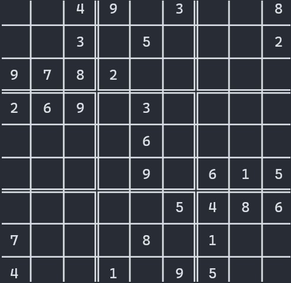
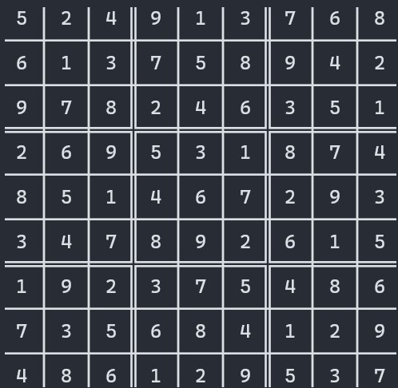

# Sudoku solver

A simple sudoku solver for the [IA302](https://perso.ensta-paris.fr/~alexandre/IA302.html) lab course at [ENSTA Paris](https://www.ensta-paris.fr/en).

## Usage

Write your sudoku in a file as in [examples/sudoku.txt](examples/sudoku.txt) or in [examples/formatted_sudoku.txt](examples/formatted_sudoku.txt). The missing values are represented by "0" or "x". All characters different from a digit or "x" is removed in the process.

Run the solver using `python solver.py [path]` where *path* is the path to the sudoku file. One can write the result in a file using the `-o` option. No dependencies are required.

Output:

## Possible improvements

- Add a heuristic: sort missing values by the number of choices to branch on (len of possible values). It requires some modifications to the indexing part because: 
  1. we want to remove from the "missing_values" variable all the elements that can be directly filled. 
  2. We also want to jointly sort the missing values and the possible values
  - Solution: merge the two data structures
  - We can then solve the variables with only one solution with the domain reduction, and try to reduce the branching factor for the next variables.
- Try arc consistency or path consistency instead of a standard node consistency.
- Perform the modifications in place in the command line.